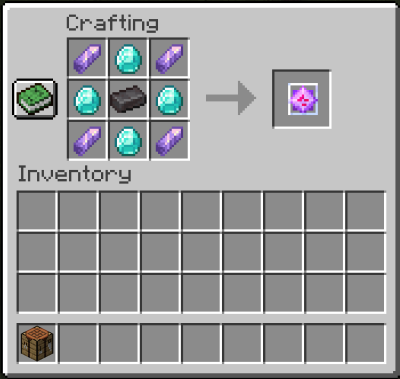

# MML Life Plugin

Tento plugin riesi zivoty hracov. 

Je urceny pre [papermc server](https://papermc.io/) verzie 
[1.17.1](https://papermc.io/api/v2/projects/paper/versions/1.17.1/builds/266/downloads/paper-1.17.1-266.jar) 

Plugin je mozne otestovat na serveri **185.91.116.101**

Hrac pri provom prihlaseni sa na server obdrzi **urcity pocet zivotov** (je to zavisle od konfiguracie pluginu na serveri,
defaultna hodnota je **5**).
Po kazdej smrti sa hracovi **odpocita jeden zivot**. Ked hrac strati vsetky zivoty stava sa **duchom**.

Duch je neviditelny a ziari. **Nemoze nicit bloky** ale **moze zbierat veci, interagovat s objektami** 
(napr. otvarat dvere, vyberat truhlice) a **moze bojovat proti hracom aj inym mobom**.

Hrac obzivne ak znova bude mat viac zivotov ako 0. Zivot hrac moze ziskat pouzitim **krystalu zivota** alebo ak sa **podeli s nim o svoj zivot iny hrac**.

Je mozne nastavit *ozivovaci interval* (defaultne kazdych **7 dni**), kedy sa vsetkym hracom (aj tym ktori su momentalne offline) 
**pripocita urcity pocet zivotov** (zavisle od konfiguracie pluginu na serveri defaultne **5**).

OP moze nastavit pocet zivotov lubovolnemu hracovi. Ak nastavi nejakemu hracovi zivoty na 0 stava sa z daneho hraca duch.

## Instalacia pluginu 

**[mml-life-plugin-1.0.1.jar](https://github.com/marosbfm/mml-life-plugin/releases/download/v1.0.1/mml-life-plugin-1.0.1.jar)** je potrebne nakopirovat do adresara **plugins** na serveri.

## Konfiguracia pluginu

Poprvom spusteni serveru s pluginom (ak server bezi tak po nakopirovani pluginu je potrebne cez konzolu servera 
spustit prikaz **reload**) vznikne v korenovom adresari servera subor **plugins/mml-life-plugin/config.yml** 

- mml-life-plugin: 
  - lives-count: 5 - pocet zivotov ktore hrac obdrzi pri starte servera a taktiez pri *ozivovacom intervale*
  - life-adding-cycle: - konfiguracia *ozivovacieho cyklu* - po akom casom intervale sa maju pripocitat zivoty uvedene v parametre lives-count vsetkym hracom
    - amount: 7 - pocet
    - unit: DAYS - jednotka - mozne nastavit nasledujuce MINUTES HOURS DAYS WEEKS 
    - ts: 1631822104 - [UNIX time stamp](https://www.unixtimestamp.com/) (pocet sekund uplynutych od 1.1.1970 UTC) od posledneho *ozivovania*
  - players: - json serializovana mapa reprezetujuca hracov a ich zivoty - prepisuje sa pocas hrania na serveri

## Prikazy

### mmlmylife
Zobrazi kolko ma hrac zivota.

**/mmlmylife**

alias: mmlml

### mmllife
Zobrazi kolko zivota ma hrac uvedeny ako parameter prikazu.

**/mmllife [player]**

alias: mmll

### mmlgivelife:
Umozni aby hrac dal svoj zivot inemu hracovi. Hrac nemoze dat viac zivotov nez ma. Ak ostane hracovi 0 zivota stava sa duchom.
Pocet musi byt cele cislo vacsie alebo rovne 0.

**/mmlgivelife [player] pocet**

pocet - cislo > 0

alias: mmlgl

### mmlsetlife:

OP nasetuje zivot hracovi. Pocet musi byt cele cislo vacsie alebo rovne 0.

**/mmlsetlife [player] pocet**

pocet - cislo > 0

alias: mmlsl

permission: op

### mmlcycleinfo

Zobrazi informaciu o ozivovacom cykle. Kedy bol naposledy, kedy bude najblyssie a kolko zivotov bude pridanych.

**/mmlcycleinfo**

alias: mmlci

### mmlhelp
Napoveda ku pluginu Mml Life.

**/mmlhelp**

alias: mmlh

## Krystal zivota

Krystalom zivota si hrac moze pridat jeden zivot. Krystal sa pouzije tak ze ho hrac bude mat v ruke a spravi lavy klik mysou.

### Recept

"ACA"

"CBC"

"ACA"

- A  je material AMETHYST_SHARD
- B  je material NETHERITE_INGOT
- C  je material DIAMOND

## Discord 

https://discord.com/invite/ScVuFsrr
